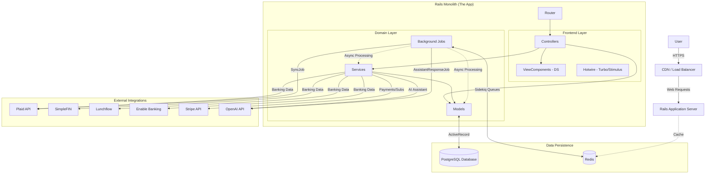

# Application Architecture

This document outlines the high-level architecture of the **Sure** application, a personal finance management system built as a Ruby on Rails 7 monolith.

## Architecture Diagram

## System Overview

### 1. Core Technology Stack
- **Framework:** Ruby on Rails 7.2
- **Language:** Ruby 3.x
- **Database:** PostgreSQL (Primary storage with extensive JSONB and UUID usage)
- **Background Jobs:** Sidekiq with Redis
- **Frontend:** Hotwire (Turbo & Stimulus), ViewComponent, Tailwind CSS

### 2. Domain Model
The application is centered around the **Family** concept as the primary tenant.
- **Family:** Groups Users, Accounts, and financial data.
- **Account:** A polymorphic model (`accountable`) supporting various types:
  - `Depository`, `Investment`, `CreditCard`, `Loan`, `Crypto`
- **Financial Core:**
  - **Transactions:** Represents spending/income events.
  - **Entries:** The double-entry ledger backing for transactions.
  - **Categories & Merchants:** For organization and reporting.

### 3. Key Subsystems

#### Banking Sync
Automated data fetching is handled via background jobs (`SyncJob`) connecting to multiple providers:
- **Plaid** & **SimpleFIN** (Primary aggregators)
- **Lunchflow** & **Enable Banking** (Additional providers)

#### AI Assistant
Integrated chat interface using **OpenAI**:
- Models: `Chat`, `Message`
- Processing: `AssistantResponseJob` handles streaming responses and context management.

#### Subscription Management
- **Stripe** integration for handling billing and subscriptions at the Family level.

### 4. Frontend Architecture
- **Server-Side Rendering:** HTML is rendered on the server using `ERB` and `ViewComponents`.
- **Reactivity:** `Turbo` handles navigation and partial page updates (SPA-like feel without JSON APIs).
- **Interactivity:** `Stimulus` controllers provide JavaScript behavior for UI elements.
- **Design System:** A custom set of UI components located in `app/components/DS`.
